---
tags:
  - reinforcement-learning
  - sutton-barto
  - rl-math
aliases:
  - discount rate
  - discount factor
  - gamma
  - Gamma
  - impatience knob
---

# ⏳ The Discount Rate (Gamma)

> [!NOTE] Foundations & Context
> In Reinforcement Learning, the **Discount Rate** (represented by the Greek letter $\gamma$ or **Gamma**) dictates how an agent balances immediate gratification against long-term planning. It acts as the mathematical control for the agent's "horizon of foresight."

---

## 1. The Financial Intuition

Consider a simple question: 
> *Would you rather receive $100 right now, or $100 exactly one year from now?*

Universally, you would choose the $100 right now. Why? Because the future is inherently uncertain, inflation reduces purchasing power, and having resources *today* allows you to utilize them immediately. 

In Reinforcement Learning, **Gamma ($\gamma$)** is the mathematical formalization of this concept. It serves as the **"Impatience Knob"** of the AI:
*   A **low $\gamma$ (close to 0)** makes the agent short-sighted (myopic), caring only about immediate, high-speed rewards.
*   A **high $\gamma$ (close to 1)** makes the agent far-sighted (strategic), willing to endure immediate penalties if they lead to massive payoffs down the line.

---

## 2. The Core Problem: The Infinite Loop

Why can't we just set $\gamma = 1$ and value all future rewards equally? 

For **Episodic Tasks** (which have a clear ending), this is sometimes possible. But for **Continuous Tasks** (which never end, such as stabilizing active hardware systems), valuing all steps equally breaks the mathematics of learning.

### The Infinity Paradox
Imagine training **ONYX** (your smart glasses AI) to manage system power:
1. If ONYX receives a reward of $+1$ point for every second the glasses stay powered on.
2. In a continuous task, if ONYX looks infinitely into the future without discounting, the total expected reward adds up to infinity:

$$G_t = 1 + 1 + 1 + 1 + \dots = \infty$$

3. Because **every** sequence of actions eventually leads to infinite points, the learning math breaks down. If every choice yields a value of $\infty$, then no choice is mathematically better than any other. 
4. The AI suffers from **decision paralysis**—it gets stuck, procrastinates, or defaults to erratic, non-functional behaviors because it cannot differentiate between a good action and a lazy one.

---

## 3. First Principles Math

To resolve the infinity paradox, we introduce the **Discount Factor ($\gamma$)**, which is strictly bounded:

$$0 \le \gamma < 1$$

At every step forward into the future, the value of the reward is discounted exponentially. The expected **Discounted Return ($G_t$)** is defined mathematically as:

$$G_t = R_{t+1} + \gamma R_{t+2} + \gamma^2 R_{t+3} + \gamma^3 R_{t+4} + \dots = \sum_{k=0}^{\infty} \gamma^k R_{t+k+1}$$

### The Temporal Decay of Rewards
As time ticks forward, the weight of future rewards shrinks exponentially:

```mermaid
gantt
    title Temporal Reward Value Decay (Gamma = 0.90)
    dateFormat  X
    axisFormat %s
    
    section Worth 100%
    Step t+1 (Now) : active, 0, 1
    
    section Worth 90%
    Step t+2 (1s)  : active, 1, 2
    
    section Worth 81%
    Step t+3 (2s)  : active, 2, 3
    
    section Worth 73%
    Step t+4 (3s)  : active, 3, 4
    
    section Worth 35%
    Step t+11 (10s): active, 10, 11
```



*   **Step $t+1$ (Immediate)**: Worth $R_{t+1} \times 1.0$ (100% of value)
*   **Step $t+2$ (1 Step Away)**: Worth $R_{t+2} \times \gamma$
*   **Step $t+3$ (2 Steps Away)**: Worth $R_{t+3} \times \gamma^2$
*   **Step $t+n$ ($n-1$ Steps Away)**: Worth $R_{t+n} \times \gamma^{n-1}$

---

## 4. Concrete Numerical Case Study (ONYX)

Let’s look at a battery optimization reward under two different Gamma settings. Suppose ONYX can earn a $+10$ point reward for executing a major system optimization:

| Step Distance | Formula | 🔴 Impatient Agent ($\gamma = 0.90$) | 🔵 Strategic Agent ($\gamma = 0.99$) |
| :--- | :--- | :--- | :--- |
| **Step 1 (Now)** | $10 \times \gamma^0$ | **10.00 points** (Full Value) | **10.00 points** (Full Value) |
| **Step 5 (4s later)** | $10 \times \gamma^4$ | **6.56 points** (Value decayed) | **9.61 points** (Nearly intact) |
| **Step 10 (9s later)** | $10 \times \gamma^9$ | **3.87 points** (Heavily decayed) | **9.14 points** (Highly valued) |
| **Step 50 (49s later)** | $10 \times \gamma^{49}$ | **0.06 points** (Effectively forgotten) | **6.11 points** (Still significant) |

### Resolving the Infinite Sum Bounding
If the agent receives a constant reward of $+R$ at every single step forever, the infinite sum converges to a finite boundary:

$$\text{Max Return } G_t = \frac{R}{1 - \gamma}$$

*   If **$\gamma = 0.90$**, the maximum possible accumulated score is capped at $10 \times R$.
*   If **$\gamma = 0.99$**, the maximum possible accumulated score is capped at $100 \times R$.

This mathematical bounding entirely resolves the infinity paradox, ensuring that algorithms can optimize policy paths cleanly.

---

## 5. Practical Engineering Guidelines

In real-world Reinforcement Learning frameworks (such as PPO, TRPO, or GRPO), setting the right Gamma is a vital hyperparameter tuning task:

```
  ┌──────────────────────────────────────────────────────────┐
  │ 0.0 ◄─────────────────── 0.90 ───────────────────► 0.999 │
  └──────────────────────────────────────────────────────────┘
Myopic (Short-Sighted)    Standard Range          Hyper-Strategic
- Reacts only to now      - Standard balance      - Highly complex planning
- Cannot plan sequences   - Maze navigation       - Chess/Go/Reasoning
```

### 1. The Short-Sighted Agent ($\gamma \to 0$)
*   **Behavior**: Focuses exclusively on immediate step feedback.
*   **Glasses Failure Scenario**: If ONYX has $\gamma = 0.05$, and receives a reward for keeping the AR lens bright right now, it will crank the display to maximum brightness to get the immediate reward. It completely ignores the fact that this extreme draw will drain the battery and shut down the glasses 30 seconds later.

### 2. The Strategic Agent ($\gamma \to 1.0$)
*   **Behavior**: Actively balances long trajectories.
*   **Glasses Success Scenario**: Setting $\gamma = 0.99$ or $0.995$ forces ONYX to dim the glasses display slightly during idle cycles or scale down the processor clock speed. Even though this dimming action yields a small immediate penalty, the agent values the massive future reward of keeping the device operational for 6 extra hours, creating an optimal power-preservation policy.

---

## 🔗 Related Notes
*   [[Reinforcement Learning]]
*   [[BOOK - REINFORCEMENT LEARNING (Sutton & Barto)]]
*   [[Episode]]
*   [[Arbitrary Control Rules]]
*   [[Markov Decision Process]]
*   [[Markov Property]]
*   [[Value Function]]
*   [[Bellman Equation]]
