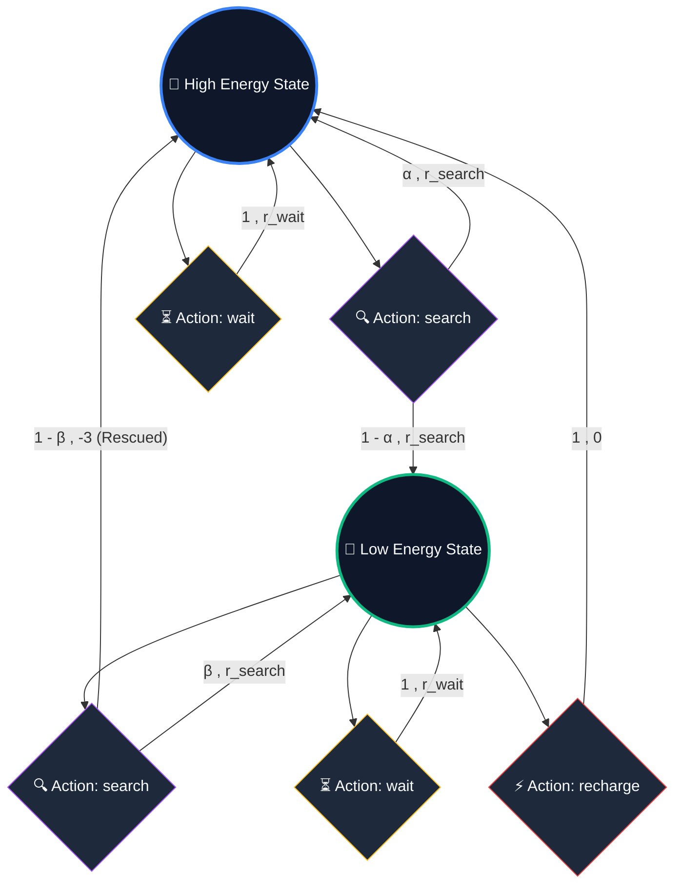

---
tags:
  - reinforcement-learning
  - sutton-barto
  - rl-theory
aliases:
  - Markov Decision Process
  - markov decision process
  - MDP
  - MDPs
  - finite MDP
  - Finite Markov Decision Process
---

# 🕸️ Markov Decision Processes (MDPs)

> [!NOTE] Foundations & Context
> As defined in Chapter 3 of [[BOOK - REINFORCEMENT LEARNING (Sutton & Barto)]], a reinforcement learning task that satisfies the **Markov Property** is called a **Markov Decision Process (MDP)**. If the state and action spaces are finite, it is a **Finite MDP**. Finite MDPs are the mathematical sandbox of Reinforcement Learning, sufficient to understand 90% of modern RL theory.

---

## 1. Defining the Dynamics of an MDP

In a finite MDP, the environment's physics, constraints, and reward schemes are completely and explicitly specified by its **one-step dynamics**. 

Given the current state $S_t = s$ and action taken $A_t = a$, the probability of transitioning to a next state $S_{t+1} = s'$ and receiving an immediate reward $R_{t+1} = r$ is defined by a single joint probability distribution:

> [!IMPORTANT] The Core Dynamics Equation
> $$p(s', r \mid s, a) = \Pr\{S_{t+1}=s', R_{t+1} = r \mid S_t=s, A_t=a\}$$
> For all $s', s \in \mathcal{S}$, $r \in \mathcal{R}$, and $a \in \mathcal{A}(s)$.

Because this function $p$ is a probability distribution, the sum of all possible outcomes must always equal $1$:

$$\sum_{s' \in \mathcal{S}} \sum_{r \in \mathcal{R}} p(s', r \mid s, a) = 1, \quad \text{for all } s \in \mathcal{S}, a \in \mathcal{A}(s)$$

---

## 2. Deriving Environment Metrics from Core Dynamics

Once the one-step dynamics function $p(s', r \mid s, a)$ is specified, you can calculate *every* other property of the environment recursively:

### 1. State-Transition Probabilities
The probability of landing in a next state $s'$ given the current state-action pair, completely marginalizing over the rewards:

$$p(s' \mid s, a) = \Pr\{S_{t+1}=s' \mid S_t=s, A_t=a\} = \sum_{r \in \mathcal{R}} p(s', r \mid s, a)$$

---

### 2. Expected Rewards for State-Action Pairs
The average reward the agent expects to receive immediately after choosing action $a$ in state $s$:

$$r(s, a) = \mathbb{E}[R_{t+1} \mid S_t=s, A_t=a] = \sum_{r \in \mathcal{R}} r \sum_{s' \in \mathcal{S}} p(s', r \mid s, a)$$

---

### 3. Expected Rewards for State-Action-Next-State Triples
The average reward expected if the agent starts in state $s$, executes action $a$, and successfully lands in a specific target state $s'$:

$$r(s, a, s') = \mathbb{E}[R_{t+1} \mid S_t=s, A_t=a, S_{t+1} = s'] = \frac{\sum_{r \in \mathcal{R}} r p(s', r \mid s, a)}{p(s' \mid s, a)}$$

---

## 3. The Classic Example: The Recycling Robot

To ground this mathematics, Sutton & Barto provide the classic **Recycling Robot** example. The robot's goal is to navigate a workspace, collect empty aluminum cans, and manage its battery levels.

### 🔋 State Space ($\mathcal{S}$)
The agent makes decisions solely as a function of the battery's energy level. There are two states:
$$\mathcal{S} = \{\text{high}, \text{low}\}$$

### 🛠️ Action Space ($\mathcal{A}(s)$)
The robot can select from three actions:
1.  **search**: Search actively for cans (high reward, drains battery).
2.  **wait**: Remain stationary and wait for someone to bring a can (lower reward, battery neutral).
3.  **recharge**: Return to home base to plug in (battery refills to `high`, 0 reward, takes a step). Recharging is only active when the battery is `low`.

Therefore:
*   $\mathcal{A}(\text{high}) = \{\text{search}, \text{wait}\}$
*   $\mathcal{A}(\text{low}) = \{\text{search}, \text{wait}, \text{recharge}\}$

### ⚙️ Environmental Physics & Dynamics
1.  **High Energy searching**: Complete safety. Searching leaves energy `high` with probability $\alpha$ and drops it to `low` with probability $1-\alpha$. Expected cans collected: $r_{\text{search}}$.
2.  **Low Energy searching**: High risk. Searching leaves energy `low` with probability $\beta$. However, with probability $1-\beta$, the battery depletes completely. The robot stalls, shuts down, and must be rescued (reward: $-3$). The battery is charged back to `high` by the rescue crew.
3.  **Waiting**: Battery level is stable. It stays in the same state with probability 1. Expected cans collected: $r_{\text{wait}}$ (where $r_{\text{search}} > r_{\text{wait}}$).
4.  **Recharging**: Home run. Transitions from `low` back to `high` with probability 1. Reward is 0.

---

### 📊 The MDP Dynamics Table

This finite MDP is completely specified by the following transition probabilities and expected rewards:

| Current State ($s$) | Action ($a$) | Next State ($s'$) | Transition Prob $p(s' \mid s, a)$ | Expected Reward $r(s, a, s')$ |
| :--- | :--- | :--- | :--- | :--- |
| **high** | **search** | **high** | $\alpha$ | $r_{\text{search}}$ |
| **high** | **search** | **low** | $1 - \alpha$ | $r_{\text{search}}$ |
| **high** | **wait** | **high** | $1$ | $r_{\text{wait}}$ |
| **high** | **wait** | **low** | $0$ | $r_{\text{wait}}$ |
| **low** | **search** | **high** | $1 - \beta$ *(Depletion / Rescue)* | $-3$ *(Rescue Penalty)* |
| **low** | **search** | **low** | $\beta$ | $r_{\text{search}}$ |
| **low** | **wait** | **high** | $0$ | $r_{\text{wait}}$ |
| **low** | **wait** | **low** | $1$ | $r_{\text{wait}}$ |
| **low** | **recharge** | **high** | $1$ | $0$ |
| **low** | **recharge** | **low** | $0$ | $0$ |

---

## 🗺️ The State-Action Transition Graph

Transition graphs summarize MDP dynamics visually. Below is the state-action transition graph for the Recycling Robot.

In this visualization:
*   **State Nodes** are represented as large circles (`🔋 High Energy`, `🪫 Low Energy`).
*   **Action Nodes** are represented as solid dark nodes.
*   The system branches from action nodes along labeled paths carrying: **Transition Probability $\to$ Expected Reward**.

---

## 🔗 Related Notes
*   [[Reinforcement Learning]]
*   [[BOOK - REINFORCEMENT LEARNING (Sutton & Barto)]]
*   [[Markov Property]]
*   [[Arbitrary Control Rules]]
*   [[Episode]]
*   [[Discount Rate]]
*   [[Value Function]]
*   [[Bellman Equation]]
