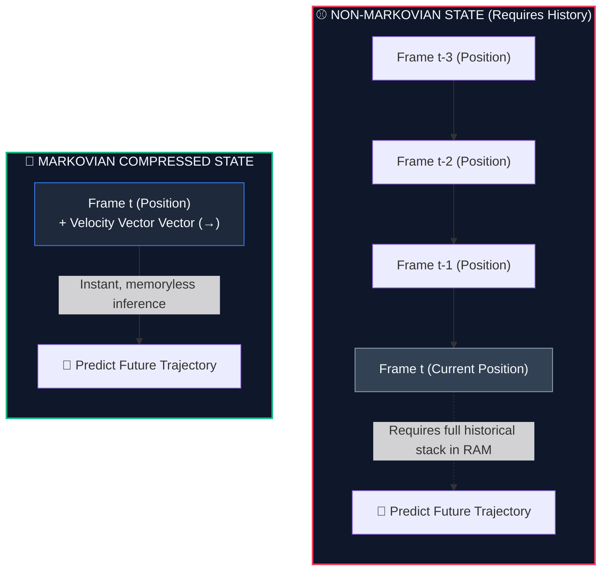

---
tags:
  - reinforcement-learning
  - sutton-barto
  - rl-theory
aliases:
  - Markov Property
  - markov property
  - memorylessness
  - Markovian State
---

# 🧠 The Markov Property (Memorylessness)

> [!NOTE] Foundations & Context
> The foundation of standard Reinforcement Learning relies on a singular mathematical assumption: the **Markov Property**. Formulated in [[BOOK - REINFORCEMENT LEARNING (Sutton & Barto)]] and named after mathematician Andrey Markov, it dictates that an agent's current state must contain *all* necessary information to make optimal decisions, rendering the history of past states irrelevant.

---

## 1. The Axiom of Memorylessness

In simple terms, the Markov Property is the rule of **Memorylessness**:

> [!IMPORTANT] The Markov Axiom
> **"The future is independent of the past, given the present."**
> This means that to predict the next state ($S_{t+1}$) and reward ($R_{t+1}$), you only need the current state ($S_t$) and action ($A_t$). The historical path of how the agent arrived at the current state has zero predictive value.

### The Mathematics of Markov
Formally, we write this as a probability distribution:

$$P(S_{t+1} = s', R_{t+1} = r \mid S_t = s_t, A_t = a_t, S_{t-1} = s_{t-1}, A_{t-1} = a_{t-1}, \dots, S_0 = s_0, A_0 = a_0) = P(S_{t+1} = s', R_{t+1} = r \mid S_t = s_t, A_t = a_t)$$

In plain English:
The massive joint probability on the left (which looks at every single state and action since the beginning of training, $S_0 \dots S_{t-1}$) collapses perfectly into the simple probability on the right. **The current slice of time is a complete summary of all past experience.**

---

## 2. The Two Classic Analogies

To understand this distinction intuitively, consider the difference between a game of Chess and a snapshot of a flying baseball:

### ♟️ Chess (Has the Markov Property)
Imagine you walk into a room halfway through a grandmaster chess match. The board is paused. 
*   **The State**: The current 2D coordinate positions of all 32 pieces on the board.
*   **The Decision**: You can sit down, inspect the board, and calculate the absolute optimal next move.
*   **Why it's Markovian**: You do not need to know the historical log of the last 40 turns. It doesn't matter if a bishop moved diagonally three times or was stagnant. The current board layout tells you **100% of the mathematical reality** needed to predict the outcome of future moves.

---

### ⚾ The Floating Baseball Snapshot (Does NOT have the Markov Property)
Imagine I show you a high-definition photograph of a baseball suspended in mid-air above a field.
*   **The State**: A single static frame showing the 3D position of the ball.
*   **The Decision**: Predict the ball's coordinates in the next 0.5 seconds so an outfielder can catch it.
*   **Why it's Non-Markovian**: You cannot solve this. Is the ball flying upwards? Is it dropping? Is it spinning? What is its horizontal velocity? The snapshot does not have enough information. To make a prediction, you are forced to look at history—specifically, the last 3 seconds of video tracking the ball.

---

## 3. The Hardware Bottleneck for ONYX

For an embedded AI system like **ONYX** (running on AR smart glasses hardware), the Markov Property is not an academic luxury—it is the ultimate hardware engineering bottleneck.

If the sensory input does not possess the Markov property, ONYX is forced to look backward continuously:
1.  **RAM Overflow**: To calculate what to do next, the glasses would need to keep every single camera frame, microphone snippet, and IMU sensor reading logged in RAM since boot. The active buffer would quickly expand, resulting in memory overflows.
2.  **Thermal & Battery Collapse**: Continuously running sequential neural network evaluations over hours of historical video frames would spike processor load, causing immediate thermal throttling and draining the smart glasses battery in minutes.

---

## 4. State Engineering: Compressing History

To build efficient embedded systems, developers use **State Engineering** to force non-Markovian environments to behave Markovian. The goal is to compress history into the current, singular time-step representation.

### How to Engineer a Markovian State:
*   **The Baseball Solution**: Instead of feeding the raw video frame history into the neural network, we calculate the derivative of the position over time and append a **Velocity Vector** ($v_x, v_y, v_z$) directly into the current state vector. Instantly, the state becomes Markovian, and past frames can be safely deleted from RAM.
*   **Temporal Stacking (Frame Staking)**: In Atari game playing (like *Pong*), a single screen shows a ball, but not its direction. Deep Q-Networks (DQN) solve this by stacking the last 4 frames together as a single input state $S_t$. This small, fixed historical window contains the velocity information, satisfying the Markov property.

### Modern State-Space Models (Mamba)
This compression technique is why **State Space Models (SSMs)** like **Mamba** are revolutionary for real-world AI hardware:
*   Standard **Transformers** must look at the entire context window (history) during generation, causing slow inference speeds as the session lengthens (quadratic complexity).
*   **Mamba** uses an elegant selection mechanism to continuously compress infinite sequence history into a fixed-size, highly dense **latent state ($h_t$)**.
*   This latent state possesses the Markov property: it summarizes the entire past into a single vector, allowing ONYX to process hours of interactions and sensor telemetry with ultra-fast speeds and incredibly low RAM footprints.

---

## 🔗 Related Notes
*   [[Reinforcement Learning]]
*   [[BOOK - REINFORCEMENT LEARNING (Sutton & Barto)]]
*   [[Markov Decision Process]]
*   [[Arbitrary Control Rules]]
*   [[Episode]]
*   [[Discount Rate]]
*   [[Value Function]]
*   [[Bellman Equation]]
*   [[NOVEL ARCHITECTURE COMPARISON]]
