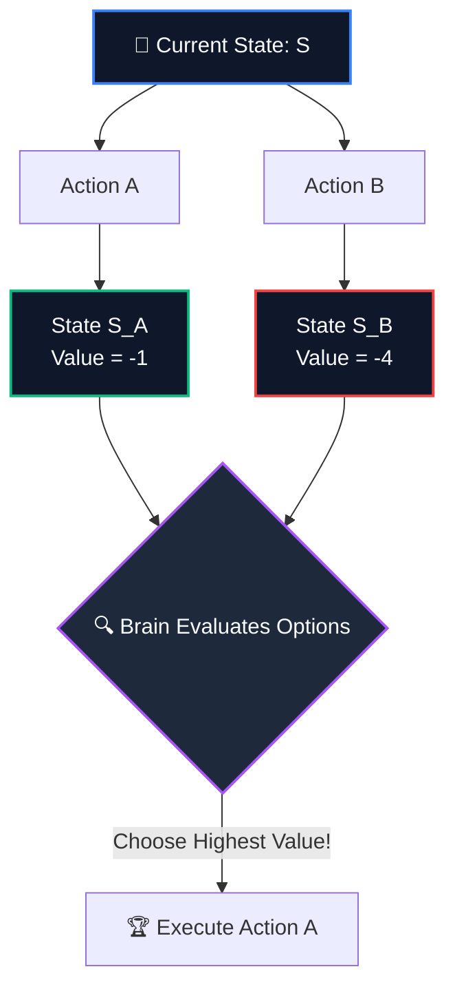

---
tags:
  - reinforcement-learning
  - sutton-barto
  - rl-basics
aliases:
  - value function
  - Value Function
  - state-value function
  - action-value function
  - Q-value
  - Q-function
  - V-function
---

# 🎯 Value Functions

> [!NOTE] Foundations & Context
> Formulated in [[BOOK - REINFORCEMENT LEARNING (Sutton & Barto)]], **Value Functions** are the primary mathematical mechanism by which an AI agent predicts the long-term future. They estimate how good a particular state (or state-action pair) is for the agent in terms of expected cumulative future returns.

---

## 1. Reward vs. Value: The Temporal Split

To understand value functions, you must first establish the difference between a **Reward** (immediate gratification) and a **Value** (long-term outlook):

| Metric | ⚡ Immediate Reward ($R_t$) | 🔮 Long-Term Value ($V_t$) |
| :--- | :--- | :--- |
| **Temporal Focus** | **The present moment.** Immediate feedback returned on the very next step. | **The infinite horizon.** The sum of all discounted rewards expected from this step onward. |
| **Chess Analogy** | Capturing a pawn right now (**+1 Reward**). | Sacrificing your Queen to establish a forced checkmate 5 moves later (**High Value**). |
| **Life Analogy** | Eating a piece of chocolate candy (**Immediate pleasure / Positive Reward**). | Studying diligently for a rigorous exam (**Immediate stress / Negative Reward** but sets you up for a high-paying career). |
| **AI Action Goal** | **Ineffective guide on its own.** Maximizing immediate rewards leads to short-sighted, greedy, and fatal loops. | **The ultimate decision engine.** The agent's goal is to optimize its strategy to maximize long-term Value. |

---

## 2. What is the Value Function?

The **Value Function** is essentially the agent's internal "future predictor." Because a single action can trigger an unpredictable cascade of events, the agent cannot calculate the exact future. Instead, it estimates the expected sum of discounted future rewards (the **Return**, $G_t$):

$$G_t = R_{t+1} + \gamma R_{t+2} + \gamma^2 R_{t+3} + \dots = \sum_{k=0}^{\infty} \gamma^k R_{t+k+1}$$

*(Where $\gamma$ is the [[Discount Rate]], bounding future rewards).*

In practice, a value function is always defined relative to a specific strategy of behavior, called a **Policy ($\pi$)**. If the agent's strategy changes, its expected future rewards—and thus its values—will change.

Sutton & Barto define the two core value functions used in 90% of all Reinforcement Learning algorithms:

---

### 1. The State-Value Function ($v_\pi(s)$)
> **"How good is it to be in this exact spot?"**

The State-Value Function $v_\pi(s)$ evaluates the quality of a situation. It estimates the expected return if the agent starts in state $s$ and follows policy $\pi$ for all future steps:

> [!IMPORTANT] State-Value Formulation
> $$v_\pi(s) = \mathbb{E}_\pi [G_t \mid S_t = s] = \mathbb{E}_\pi \left[ \sum_{k=0}^{\infty} \gamma^k R_{t+k+1} \;\middle|\; S_t = s \right]$$

---

### 2. The Action-Value Function ($q_\pi(s, a)$)
> **"How good is it to be in this exact spot AND make this specific move?"**

The Action-Value Function $q_\pi(s, a)$ (often called the **Q-function** or **Q-value**) evaluates a specific choice within a situation. It estimates the expected return of starting in state $s$, taking arbitrary action $a$, and *subsequently* adhering to policy $\pi$ forever:

> [!IMPORTANT] Action-Value (Q-Value) Formulation
> $$q_\pi(s, a) = \mathbb{E}_\pi [G_t \mid S_t = s, A_t = a] = \mathbb{E}_\pi \left[ \sum_{k=0}^{\infty} \gamma^k R_{t+k+1} \;\middle|\; S_t = s, A_t = a \right]$$

### The Bridging Equation
The state-value of $s$ is simply the sum of all action-values branching from it, weighted by the probability of the policy selecting each action:

$$v_\pi(s) = \sum_{a \in \mathcal{A}(s)} \pi(a \mid s) q_\pi(s, a)$$

---

## 3. The Golf Analogy: Visualizing States & Values

Imagine playing a challenging round of golf. 
*   **The Reward**: You receive a penalty reward of $-1$ for every stroke you take. Your goal is to get the ball into the hole in as few strokes as possible (maximizing the negative return).
*   **The State ($s$)**: The physical coordinate where your golf ball is currently resting on the course.
*   **The Value ($v_\pi(s)$)**: The negative number of expected strokes it will take to sink the ball into the hole from that current position.

```
       [ Deep Sand Trap ] ───► (State S_A: Hard recovery) ───► Value: -4 (Requires 4 strokes)
              │
              ▼
       [ Fairway Center ] ───► (State S_B: Good position) ───► Value: -2 (Requires 2 strokes)
              │
              ▼
       [ Green Edge ]     ───► (State S_C: Near hole)     ───► Value: -1 (Requires 1 stroke)
```

*   **Green State (High Value)**: If the ball is 3 inches from the cup, the state has a very high value of **$-1$** (only 1 putt expected).
*   **Sand Trap State (Low Value)**: If the ball is buried in a deep sand hazard, the state has a very low value of **$-4$** (requires multiple strokes to recover).

By evaluating states this way, the agent learns to avoid hazards (low value states) and steer toward favorable positions (high value states) even if there is no immediate treat along the path.

---

## 4. Why is the Value Function the Ultimate Decision Engine?

Without a value function, an AI would be incredibly short-sighted, greedily grabbing immediate rewards and falling into catastrophic traps. 

In a complex world, calculating the absolute true value of every state analytically is computationally impossible. Therefore, the agent must interact with the environment, experience discrepancies between its predictions and reality, and continuously update its estimates using trial and error.

Once the agent successfully learns a high-fidelity value function ($V$ or $Q$), **optimal decision-making becomes trivial**:



The agent simply looks at all its available actions, evaluates which next state carries the highest estimated **Value**, and selects that action. The complex future has been folded into a single, consultable value map.

---

## 🔗 Related Notes
*   [[Reinforcement Learning]]
*   [[BOOK - REINFORCEMENT LEARNING (Sutton & Barto)]]
*   [[Markov Decision Process]]
*   [[Markov Property]]
*   [[Discount Rate]]
*   [[Episode]]
*   [[Arbitrary Control Rules]]
*   [[Bellman Equation]]
