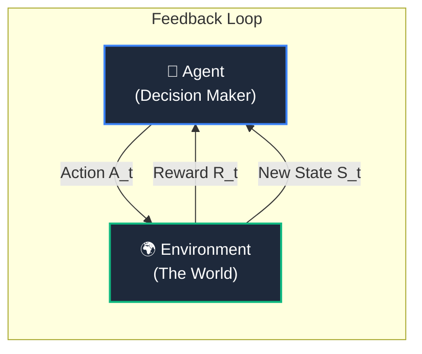

# 🐕 Reinforcement Learning (RL)

> [!NOTE] Source Context
> Defined through the lens of the seminal textbook [[BOOK - REINFORCEMENT LEARNING (Sutton & Barto)]] by **Richard S. Sutton and Andrew G. Barto**, the absolute pioneers of the field.

---

## 1. The Sutton & Barto Core Definition
According to Sutton and Barto, Reinforcement Learning is not defined by a specific machine learning algorithm, but rather by **the problem** we are trying to solve:

> *"Reinforcement learning is learning what to do—how to map situations to actions—so as to maximize a numerical reward signal. The learner is not told which actions to take, as in most forms of machine learning, but instead must discover which actions yield the most reward by trying them."*

Unlike **Supervised Learning** (where a teacher gives the model the "correct answer" label) or **Unsupervised Learning** (where the model looks for hidden structures in unlabeled data), RL is entirely based on **active interaction and feedback**.

### The Two Pillars of RL:
1.  **Trial-and-Error Search**: The agent must actively explore the environment to discover which behaviors result in positive rewards and which cause penalties.
2.  **Delayed Reward**: The agent's choices don't just affect immediate feedback. An action taken *now* might influence the next state of the world, leading to massive rewards (or catastrophes) far down the line.

---

## 2. The Core Feedback Loop
At every step in time ($t$), an **Agent** interacts with its **Environment** in a continuous loop:



1.  **State ($S_t$)**: The current "snapshot" or situation of the environment.
2.  **Action ($A_t$)**: The choice or move made by the agent.
3.  **Reward ($R_t$)**: The immediate numerical feedback score returned by the environment (positive for success, negative for failure).

---

## 3. 🦴 The Dog Training Analogy
To understand this mathematically rigorous system, imagine you are training a puppy named **Buster**. Buster represents our **Agent**, and you are using treats to teach him commands.

```
       [ 🧑 Owner Says "Sit!" ] ───► (State S)
                 │
                 ▼
         [ 🐶 Buster the Dog ] ───► (Agent)
                 │
         ┌───────┴───────┐
         ▼               ▼
     [ 🐕 Sits ]    [ 🔊 Barks ] ───► (Possible Actions A)
         │               │
         ▼               ▼
   [ 🥩 Treat! ]    [ ❌ Stern "No" ] ───► (Rewards R)
      (+10)            (-1)
```

Here is how Sutton & Barto's formal RL terms map perfectly to training Buster in your living room:

| RL Term | Scientific Definition | 🐕 The Puppy Analogy |
| :--- | :--- | :--- |
| **Agent** | The learner and decision-maker. | **Buster the Puppy.** He is the one trying to make choices that get him treats. |
| **Environment** | Everything outside the agent that it interacts with. | **The Living Room.** This includes the floor, the furniture, and you (the owner holding the treats). |
| **State ($S$)** | The current situation or sensor readings of the agent. | **You standing in front of Buster saying "Sit!".** This is the context Buster must react to. |
| **Action ($A$)** | The choices or moves available to the agent. | **Buster's choices:** He can sit down, bark at you, jump up, or run to bite the couch. |
| **Reward ($R$)** | The numerical feedback evaluating the action. | **Feedback:** Giving him a tasty beef treat (**+10**) if he sits, or saying a stern "No" (**-1**) if he barks. |
| **Policy ($\pi$)** | The agent's strategy or rulebook for choosing actions based on the state. | **Buster's internal brain mapping.** At first, his policy is random. After training, his policy becomes: *If human says "Sit", immediately put butt on carpet.* |
| **Value Function ($V$)** | The prediction of the *total future reward* from this state onward. | **Buster's long-term treat expectation.** Sitting down is good not just for one immediate treat, but because it leads to a state where he gets praised and gets *more* treats later. |

---

## 4. Explaining the Two Pillars via Buster

### 🔎 Trial-and-Error: The Exploration Dilemma
Buster does not speak English. When you say the word "Sit!", the word is just arbitrary acoustic noise to him. He cannot inspect your mind to find the "correct label."
*   **The Process**: Buster is forced to try random things. First, he barks (**Reward: -1**). Then, he jumps on you (**Reward: -1**). Finally, he accidentally sits down on the floor (**Reward: +10!**).
*   **The Discovery**: By trying different actions and observing the feedback, Buster's internal brain updates. He shifts his policy away from barking and toward sitting when he hears that specific command.

### ⏳ Delayed Reward: The Long Game
Suppose you want to train Buster to do a complex trick, like **"Retrieve the Slippers."**
1.  Buster hears "Fetch!" (**State $S_0$**).
2.  He must run to the bedroom (**Action $A_0$**). No treat is given yet (Reward = 0).
3.  He must pick up the slippers (**Action $A_1$**). Still no treat (Reward = 0).
4.  He must walk back to you and drop them at your feet (**Action $A_2$**). **Boom! Treat given (+10 reward).**

*   **The Challenge**: If Buster only cared about immediate rewards, he would never run to the bedroom because running alone doesn't give him an immediate treat.
*   **The Value Solution**: Under Sutton & Barto's equations, Buster learns to assign a high **Value** to intermediate states (like holding the slippers in the bedroom) because he knows they are stepping stones that guarantee a massive reward in the near future.

---

## 🛠️ The AI Connection: From Puppies to LLMs
We use this exact same framework to train the world's most advanced AI models:

*   **RLHF (Reinforcement Learning from Human Feedback)**: When training ChatGPT, the LLM is the "dog" (Agent). The prompt is the "command" (State). The generated answer is the "trick" (Action). A human labeler acts as the owner, scoring the response (Reward). If the AI generates a helpful, polite, and accurate answer, it gets a high score, training it to align with human preferences.
*   **GRPO (Group Relative Policy Optimization)**: Used in modern reasoning models (like DeepSeek-R1). The model generates a group of different reasoning paths (actions) for a math problem. The environment automatically tests the answers (e.g., runs the code or checks the math result) and rewards the reasoning paths that lead to the correct answer, reinforcing strict logical thinking!

---

**Related Notes**:
*   [[AI]]
*   [[Techstack]]
*   [[Markov Decision Process]]
*   [[Arbitrary Control Rules]]
*   [[Episode]]
*   [[Discount Rate]]
*   [[Markov Property]]
*   [[Value Function]]
*   [[Bellman Equation]]
*   [[NOVEL ARCHITECTURE COMPARISON]]
