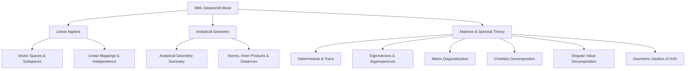

# Mathematics for Machine Learning

> *"Mathematics helps me think critically and in first principles."*

Primary Textbook: **Mathematics for Machine Learning** (Marc Peter Deisenroth, A. Aldo Faisal, and Cheng Soon Ong)
Main Reference: [[BOOK - MATHEMATICS FOR MACHINE LEARNING (Deisenroth)]]

---

## 📌 Linear Algebra & Vector Spaces
*   **Vector Spaces & Subspaces:** [[TOPICS/Linear Algebra/Vector Spaces|Vector Spaces]], [[TOPICS/Linear Algebra/Vector Subspaces|Vector Subspaces]], [[TOPICS/Linear Independence|Linear Independence]], [[TOPICS/Linear Algebra/Groups|Groups]]
*   **Linear Mappings & Matrices:** [[TOPICS/Linear Algebra/Linear Mappings|Linear Mappings]], [[TOPICS/Linear Algebra/Symmetric, Definite and Positive Matrices|Symmetric, Definite and Positive Matrices]]

## 📌 Analytical Geometry & Norms
*   **Summary:** [[TOPICS/Analytical Geometry/Analytical Geometry Summary|Analytical Geometry Summary]]
*   **Norms & Inner Products:** [[TOPICS/Linear Algebra/Norms|Norms]], [[TOPICS/Analytical Geometry/Inner product|Inner Product]], [[TOPICS/Analytical Geometry/Lengths and Distances|Lengths and Distances]]

## 📌 Matrix Decompositions & Spectral Theory
*   **Determinants & Trace:** [[TOPICS/MATRICES/Determinants and Trace|Determinants and Trace]]
*   **Eigenvectors & Eigenspectra:** [[TOPICS/MATRICES/Eigenvectors and Eigenspectrum|Eigenvectors and Eigenspectrum]]
*   **Diagonalization:** [[TOPICS/MATRICES/Diagonalization|Diagonalization]]
*   **Cholesky Factorization:** [[TOPICS/MATRICES/Cholesky Decomposition|Cholesky Decomposition]]
*   **Singular Value Decomposition:** [[TOPICS/MATRICES/Singular Value Decomposition|Singular Value Decomposition]], [[TOPICS/MATRICES/Geometric Intuition of SVD|Geometric Intuition of SVD]]

---

## 🗺️ Topic Map

