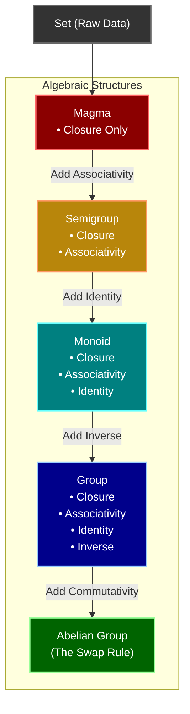

# 🌀 Groups

> [!NOTE] Source Context
> This concept was learned from [[BOOK - MATHEMATICS FOR MACHINE LEARNING (Deisenroth)]]. In modern machine learning, group theory forms the bedrock of **Geometric Deep Learning**, **Symmetries**, and the algebraic structures (like Vector Spaces) that allow us to manipulate high-dimensional data.

---

## 1. The Core Definition
At its heart, a **Group** is like a highly exclusive **"Math Club."** To officially form a group, you need two things:

1. **A Set ($\mathcal{G}$)**: The raw data (e.g., integers, 3D rotations, pixels, or a grid of matrix weights).
2. **An Operation ($\otimes$)**: The rule for how members of the set interact (e.g., addition, multiplication, function composition).

We denote the group as the pair $(\mathcal{G}, \otimes)$.

---

## 2. The 4 Non-Negotiable Rules (The Engine)
To be a valid "Math Club" (Group), the set and its operation must obey **four strict rules**. These rules guarantee that the algebraic equation $A \otimes X = B$ can *always* be solved, and every action can be cleanly reversed without crashing the system or leaving the mathematical universe.

### Ⅰ. Closure
$$\forall x, y \in \mathcal{G} \implies x \otimes y \in \mathcal{G}$$

*   **👶 The 5yo Explanation**: Combining two club members always produces another club member. You can never "escape" the club by combining its members.
*   **💻 The Engineering Reality**: **No Type-Mismatch Errors.** Operating on two valid data points of type $T$ will never accidentally spit out a corrupted string, a `NaN`, or an out-of-bounds object. Adding two 3D vectors will always give you a valid 3D vector.
*   **🎲 Concrete Example**: Under addition, adding any two integers (e.g., $5 + 3 = 8$) always yields another integer.
 
---

### Ⅱ. Associativity
$$(x \otimes y) \otimes z = x \otimes (y \otimes z)$$

*   **👶 The 5yo Explanation**: If you have a long chain of actions, it doesn't matter which pair you calculate first, as long as the order of the chain is kept.
*   **💻 The Engineering Reality**: **Parallel Computing & Batching.** Because the grouping of operations doesn't affect the final result, you can safely partition computations, distribute them across multiple GPU cores, and execute them in parallel (like a MapReduce or parallel prefix sum) without altering the final output.
*   **🎲 Concrete Example**: $(2 + 3) + 4 = 2 + (3 + 4) = 9$.

---

### Ⅲ. Identity (Neutral Element)
$$\exists e \in \mathcal{G} \text{ such that } \forall x \in \mathcal{G} : x \otimes e = x = e \otimes x$$

*   **👶 The 5yo Explanation**: There is a "Ghost" or "Zero" state that does absolutely nothing when combined with anyone else.
*   **💻 The Engineering Reality**: **Default Configuration or Rest State.** You can establish a reliable "do-nothing" state in your code (e.g., a rotation of $0^\circ$, an empty offset vector, or a scaling factor of $1.0$).
*   **🎲 Concrete Example**: In addition, the number $0$ is the identity ($5 + 0 = 5$). In multiplication, the number $1$ is the identity ($5 \times 1 = 5$).

---

### Ⅳ. Inverse Element
$$\forall x \in \mathcal{G}, \exists y \in \mathcal{G} \text{ such that } x \otimes y = e = y \otimes x$$

*   **👶 The 5yo Explanation**: Every single action in the club has a perfect **"Undo"** button.
*   **💻 The Engineering Reality**: **Lossless Undo & Reversibility.** No information is permanently destroyed. If a reinforcement learning agent moves a virtual robot arm, or a generative model transforms an image, you can map it perfectly back to its origin without loss of state.
*   **🎲 Concrete Example**: For any integer $x$, its additive inverse is $-x$, because $x + (-x) = 0$ (the identity).

---

## 3. What Happens When You Break the Rules?
If you strip away these rules one by one, you degrade the mathematical universe into weaker, more chaotic structures:

*   **💔 Monoid (No Inverse / Undo)**: You can't reverse operations. 
    *   *Example*: **Time** or **Word Concatenation** (string joining). You can add words together (`"cat" + "dog" = "catdog"`), but you can't subtract `"dog"` to get back a string if you only have the resulting concatenated representation.
*   **💔 Semigroup (No Identity / Rest State)**: A system in perpetual motion.
    *   *Example*: The set of positive integers $\{1, 2, 3, \dots\}$ under addition. There is no $0$, so you can never rest or remain still.
*   **💔 Magma (No Associativity / Chaos)**: Total ordering chaos.
    *   *Example*: **Subtraction** on integers. $(10 - 5) - 2 = 3$, but $10 - (5 - 2) = 7$. The order of computation completely alters the physical universe!

---

## 4. The VIP Upgrades
Once a Group satisfies the baseline 4 rules, it can unlock premium, higher-tier capabilities that make it incredibly useful for machine learning.

### 👑 Abelian Group (The Swap Rule)
An **Abelian Group** is a group that unlocks **Commutativity**:
$$x \otimes y = y \otimes x$$

*   **🚀 Why it matters in ML**:
    *   **Abelian (Commutative)**: Coordinate translation. Moving an image 5 pixels right, then 3 pixels up is exactly the same as moving it 3 pixels up, then 5 pixels right.
    *   **Non-Abelian (Non-Commutative)**: Matrix multiplication (neural network weights) and 3D rotations ($SO(3)$). If you rotate a 3D camera $90^\circ$ around the X-axis and then $90^\circ$ around the Y-axis, you end up with a completely different view than if you did Y first, then X. This is why multiplying weights in neural layers must happen in a strictly defined sequence!

### 💎 Vector Subspace (The Scaling Upgrade)
If you take an **Abelian Group** (using addition) and inject a **Field** (like real numbers $\mathbb{R}$) to allow scaling/stretching of elements, you get a **Vector Space**!
*   **🚀 Why it matters in ML**:
    *   A **Vector Subspace** is a flat slice of a massive, high-dimensional space (e.g., 10,000-dimensional word embeddings) that is strictly anchored at the origin $(0, 0, \dots, 0)$.
    *   By projecting huge datasets onto these lower-dimensional subspaces (via PCA, SVD, or autoencoders), a local AI model can analyze, compress, and process patterns instantly without draining hardware battery.

---

## 5. Reading the "Alien" Syntax
When reading machine learning papers or Deisenroth's book, you will run into mathematical shorthands. Use this cheat sheet to translate them instantly:

| Symbol | Pronunciation | What it actually means |
| :---: | :--- | :--- |
| **$\forall$** | "For all" | "No matter which one you pick, this rule is always true." |
| **$\exists$** | "There exists" | "We can find at least one special element that does this." |
| **$\in$** | "In / Member of" | "Is a part of this collection/set." |
| **$\notin$** | "Not in" | "Is excluded from this collection/set." |
| **$\implies$** | "Implies / If-Then" | "If the left side is true, the right side is guaranteed to happen." |
| **$\mathbb{R}^n$** | "R-n" | "An $n$-dimensional space made of continuous real numbers." |
| **$\mathcal{G}$** | "G" | "The set of elements representing our group." |

---

## 🛠️ The ML Engineer's Secret: Why Do We Care?

1. **Geometric Deep Learning (Symmetries)**: E-CNNs (Equivariant Convolutional Neural Networks) build the group of translations and rotations directly into the network architecture. This ensures that if a medical imaging AI is looking at a tumor, it classifies it correctly regardless of whether the tumor is rotated or shifted in the scan.
2. **Data Augmentation**: When you rotate, flip, or scale an image to train a model, you are applying operations from a **Transformation Group**. Since the label (e.g., "dog") remains invariant under these group operations, you teach the model to learn the underlying group symmetries.
3. **Weight Orthogonalization**: Keeping weight matrices within the Orthogonal Group $O(n)$ prevents gradients from exploding or vanishing during training, allowing very deep networks to train stably.

---

**Related Notes**:
*   [[BOOK - MATHEMATICS FOR MACHINE LEARNING (Deisenroth)]]
*   *Add links to other linear algebra and topology notes as you create them!*
