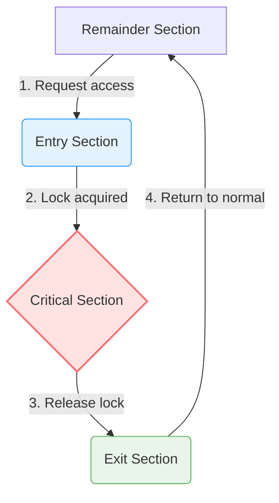

# 🚪 The Critical Section Problem

> [!NOTE] Context & References
> **Parent Note**: [[Synchronization Tools]]
> **Theoretical Source**: [[BOOK - OPERATING SYSTEM CONCEPTS (Silberschatz, Galvin & Gagne)]]
> **Prerequisite Concept**: [[Race Condition]]

---

## 📌 What is the Critical Section Problem?

In a concurrent computing environment, cooperative processes or threads must share resources (such as memory, files, or ports). A **Critical Section** is a specific block of code within a process where shared data is accessed and modified. 

The **Critical Section Problem** is the challenge of designing a synchronization protocol that processes can use to coordinate their activities so that **no two processes execute inside their critical sections concurrently**. 

---

## 🧱 The General Structure of a Cooperative Process

To design a clean synchronization protocol, we abstract the structure of a participating process into four distinct logical zones:

1. **Entry Section**: The gatekeeper. The process requests permission to enter its critical section by executing synchronization code (e.g., acquiring a lock).
2. **Critical Section**: The danger zone. Here, the process performs operations that modify shared state (e.g., modifying a database record, writing a file, updating a counter).
3. **Exit Section**: The exit gate. Here, the process releases the lock or updates the state to signal other waiting processes that it has finished.
4. **Remainder Section**: The safe zone. The process executes its non-shared, independent computations.

---

## 📐 The Three Golden Requirements for a Valid Solution

According to the Silberschatz & Galvin standard, any correct and complete software or hardware solution to the critical-section problem **must satisfy all three** of the following criteria:

### 1. Mutual Exclusion (Safety)
> **If process $P_i$ is executing in its critical section, then no other processes can be executing in their critical sections.**
* **Why it matters**: This is the fundamental safety property. If violated, race conditions occur, leading to unpredictable data corruption.

### 2. Progress (Liveness / Deadlock Prevention)
> **If no process is executing in its critical section and some processes want to enter, only those processes not executing in their remainder sections can participate in deciding which process enters next, and this selection cannot be postponed indefinitely.**
* **Why it matters**: It guarantees that the system doesn't freeze (deadlock) when the critical section is empty and multiple threads want to enter. Processes in the *Remainder Section* have no say in the decision.

### 3. Bounded Waiting (Liveness / Starvation Prevention)
> **There must be a limit on the number of times other processes are allowed to enter their critical sections after a process has made a request to enter its critical section and before that request is granted.**
* **Why it matters**: It ensures that every requesting process will eventually get its turn, preventing a process from waiting forever (starvation) while other processes continuously cycle in and out of the critical section.

---

## 🖥️ The Critical Section Problem in OS Kernels

The operating system kernel itself is a concurrent program. Multiple kernel threads or system calls might access shared tables, list of open files, page tables, or PID trackers concurrently. 

To handle this, OS kernel designs generally use one of two architectures:

| Kernel Architecture | Mechanics | Pros & Cons |
| :--- | :--- | :--- |
| **Non-preemptive Kernel** | A process running in kernel mode **cannot be interrupted** by another process, unless it blocks or voluntarily yields the CPU. | 🟢 **Simple**: Inherently free of race conditions on kernel structures on single-core setups. 🔴 **Unresponsive**: Real-time processes might experience severe latency waiting for kernel operations to yield. |
| **Preemptive Kernel** | A process running in kernel mode **can be preempted** (interrupted) at any time to execute a higher-priority task. | 🟢 **Highly Responsive**: Essential for real-time systems and interactive UX. 🔴 **Complex**: Extremely difficult to design; requires robust, carefully placed synchronization primitives throughout the kernel source. |

### 🛡️ Why Non-Preemptive Kernels Don't Have Race Conditions (On Single-Core)

A non-preemptive kernel does not allow a process running in kernel mode to be preempted (forcibly removed from the CPU). Instead, the running kernel-mode process will keep control until it voluntarily exits kernel mode, blocks (e.g., waiting for I/O), or explicitly yields the CPU. 

* **The Single-Process Guarantee:** At any given moment, **only one process is active inside the kernel**. 
* **The Result:** Because there is no interleaving of instructions from multiple processes in kernel space, and no concurrent access to shared kernel memory on single-core systems, **race conditions are structurally impossible**. This significantly simplifies kernel design.

### 🏎️ Why Modern Operating Systems Require Preemptive Kernels

Despite the extreme design complexity and the absolute necessity of robust synchronization tools (such as mutex locks and spinlocks) to prevent race conditions, **almost all modern operating systems (Linux, Windows, macOS) use preemptive kernels**. 

This preference is driven by two critical system requirements:

1. **System Responsiveness**
   - In a non-preemptive kernel, if a process triggers a long-running, poorly designed, or infinite loop in kernel mode, the entire system freezes, and all other user-space processes are starved of CPU time.
   - A preemptive kernel allows the OS scheduler to interrupt the unresponsive kernel-mode process, distributing CPU cycles fairly and maintaining smooth UI responsiveness.

2. **Real-Time Computing & Predictability**
   - Real-time applications (such as robotics, audio processing, or automotive systems) require strict, predictable execution deadlines.
   - If a critical, high-priority real-time event occurs, a preemptive kernel ensures that the urgent process can **immediately preempt** any running lower-priority kernel process, eliminating latency and satisfying real-time timing constraints.
