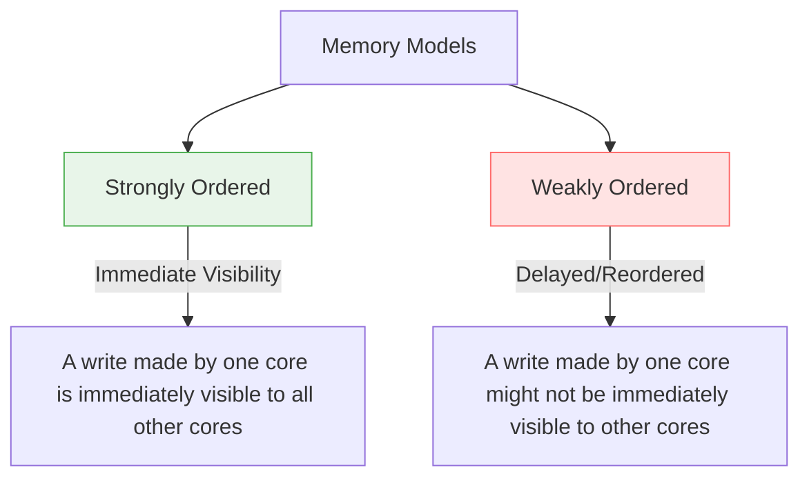

# 🔌 Hardware-based Synchronization

> [!NOTE] Context & References
> **Parent Note**: [[Synchronization Tools]]
> **Theoretical Source**: [[BOOK - OPERATING SYSTEM CONCEPTS (Silberschatz, Galvin & Gagne)]]
> **Related Concepts**: [[Peterson's Solution]] (Why it fails on modern CPUs)

---

## 📌 Memory Models & CPU Architectures

Modern computer systems utilize multiple processing cores, each with its own local caches and registers. How these cores perceive read and write operations to main memory is defined by the hardware architecture's **Memory Model**. 

A **Memory Model** represents the specific behavioral guarantees a computer architecture provides to an application program regarding memory visibility.

Architectures generally fall into one of two categories:



### 1. Strongly Ordered Memory Model
A memory modification made by one processor core is immediately visible to all other processor cores in the system. 
* *Example*: Traditional single-core architectures, or highly coordinated multi-core systems with aggressive hardware bus-snooping/cache-coherency protocols.

### 2. Weakly Ordered Memory Model
Modifications made to memory on one processor core may **not** be immediately visible to other cores. Furthermore, processors and compilers are permitted to **reorder memory operations (reads and writes)** to optimize execution pipeline speed, provided the reordering does not violate dependencies within a single thread.
* *Example*: Modern ARM and x86 architectures operate under varying degrees of weak memory ordering to achieve high clock speeds and energy efficiency.

---

## 🚧 Memory Barriers (Memory Fences)

Because memory models vary depending on the hardware platform, kernel developers and systems programmers cannot assume that changes to variables will propagate instantly across a shared-memory multiprocessor. 

To address this, computer architectures provide special CPU instructions known as **Memory Barriers** (or **Memory Fences**).

> [!IMPORTANT] Definition
> A **Memory Barrier** is a hardware instruction that forces the CPU and compiler to preserve strict ordering of memory access operations (reads and writes) across its execution boundary. Any memory operations initiated before the barrier are guaranteed to complete and become visible to other processors before any memory operations initiated after the barrier are allowed to execute.

---

## 🔬 Practical Example: Guaranteeing Thread Coordination

Consider two shared variables `x` (initialized to `0`) and `flag` (initialized to `false`).

* **Thread A** performs a computation and publishes the result in `x`.
* **Thread B** waits for `flag` to become `true`, then reads `x`.

### ❌ Without Memory Barriers (The Race Condition)
Because `x = 100` and `flag = true` have no data dependency within Thread A, a weakly-ordered CPU or optimizing compiler might reorder the operations:

```c
// Thread A
flag = true;  // Reordered to run first!
x = 100;
```

If Thread B runs concurrently, it might see `flag == true`, exit its loop, and read `x` as `0` (before Thread A actually executes `x = 100`), leading to a critical logical error.

---

### 🟢 With Memory Barriers (The Correct Fix)
By inserting memory barriers, we force the CPU/compiler to preserve the logical sequence across both cores:

| Thread A (Producer) | Thread B (Consumer) |
| :--- | :--- |
| `x = 100;` | `while (!flag);` (Wait for flag) |
| **`memory_barrier();`** *(Forces write of x to complete before flag is written)* | **`memory_barrier();`** *(Forces flag to be read before reading x)* |
| `flag = true;` | `print(x);` *(Guaranteed to print 100)* |

---

## 🗂️ Hardware-based vs. Software-based Synchronization

As we have seen, pure software-based algorithms like [[Peterson's Solution]] fail on modern systems because they rely on sequential ordering guarantees that modern hardware does not provide out-of-the-box. 

Therefore, modern synchronization tools (like Mutex locks, Semaphores, and Atomic variables) are all built on top of hardware-based synchronization primitives, combining memory barriers with atomic **[[Hardware Instructions]]** (such as `test_and_set()` and `compare_and_swap()`).
