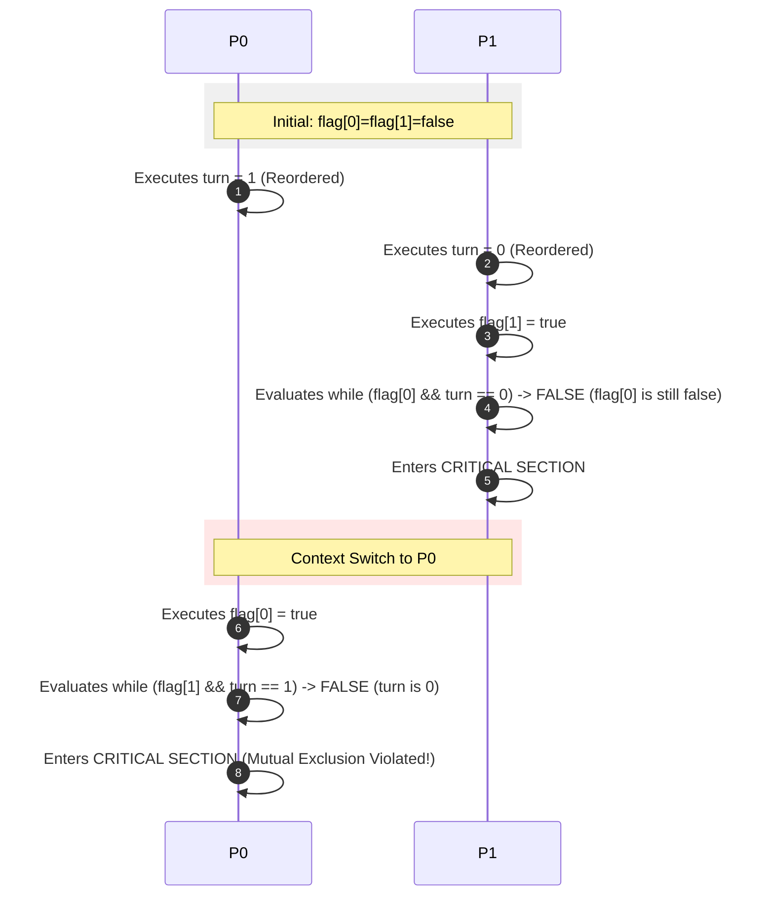

# ⚖️ Peterson's Solution

> [!NOTE] Context & References
> **Parent Note**: [[Synchronization Tools]]
> **Theoretical Source**: [[BOOK - OPERATING SYSTEM CONCEPTS (Silberschatz, Galvin & Gagne)]]
> **Prerequisite Concept**: [[Critical Section Problem]]

---

## 📌 What is Peterson's Solution?

**Peterson’s Solution** is a classic, software-based algorithm designed by Gary L. Peterson in 1981 to solve the critical-section problem for **two processes** (typically denoted as $P_0$ and $P_1$) that alternate execution in a shared memory environment. 

It serves as a brilliant conceptual framework for understanding process synchronization, demonstrating how mutual exclusion can be achieved purely in software without special hardware assistance.

---

## 💻 The Algorithm

To coordinate the two processes $P_i$ and $P_j$ (where $j = 1 - i$), the algorithm shares two specific data structures:

*   `boolean flag[2];` — Initialized to `false`. If `flag[i]` is `true`, it indicates that process $P_i$ is **ready** to enter its critical section.
*   `int turn;` — Indicates **whose turn** it is to enter the critical section.

### Pseudo-code Structure for Process $P_i$

```c
while (true) {
    /* --- ENTRY SECTION --- */
    flag[i] = true;             // Express intent to enter
    turn = j;                   // Be polite: give the turn to the other process
    
    // Busy-wait while the other process is ready AND it is their turn
    while (flag[j] && turn == j) {
        // Do nothing (busy-wait)
    }

    /* --- CRITICAL SECTION --- */
    // Access and modify shared data
    
    /* --- EXIT SECTION --- */
    flag[i] = false;            // Declare that we are done

    /* --- REMAINDER SECTION --- */
    // Do independent work
}
```

---

## 🔄 How It Works (Breaking the Tie)

1. **Expressing Intent:** When process $P_i$ wants to enter its critical section, it announces its readiness by setting `flag[i] = true`.
2. **Politeness Constraint:** It immediately yields the turn to its opponent by setting `turn = j`. This says: *"If you also wish to enter right now, you may go first."*
3. **Collision Handling:** 
   - If only one process is active (say $P_i$), `flag[j]` is `false`. The loop `while (flag[j] && turn == j)` evaluates to `false` immediately, and $P_i$ enters its critical section.
   - If both attempt to enter at the exact same time, both set their flags to `true` and both assign `turn` to their opponent.
   - **The Tiebreaker:** Since `turn` is a single shared memory cell, the last assignment wins. If $P_1$ writes `turn = 0` last, then `turn` remains `0`. Thus, $P_1$ will spin in the `while` loop (since `flag[0] && turn == 0` is `true`), while $P_0$ will break out and enter the critical section.

---

## 📐 Mathematical Proof of Correctness

Peterson's solution mathematically satisfies all three requirements of the critical-section problem:

### 1. Mutual Exclusion
* **Proof**: Suppose both $P_0$ and $P_1$ are executing in their critical sections simultaneously.
* This implies `flag[0] == true` and `flag[1] == true`.
* For $P_0$ to enter, it must have found `flag[1] == false` or `turn == 0`.
* For $P_1$ to enter, it must have found `flag[0] == false` or `turn == 1`.
* Since both flags are `true`, we must have `turn == 0` and `turn == 1` simultaneously, which is a logical contradiction.
* Therefore, only one process can enter the critical section at a time.

### 2. Progress
* **Proof**: If $P_i$ is stuck in the entry section `while (flag[j] && turn == j)`, it means $P_j$ is either in its critical section or has set `flag[j] = true` and is waiting.
* If $P_j$ is not ready, `flag[j] == false`, so $P_i$ immediately enters (no block).
* If $P_j$ exits its critical section, it executes the exit section setting `flag[j] = false`, immediately releasing $P_i$.
* Thus, decision-making is immediate and relies only on processes not in their remainder sections.

### 3. Bounded Waiting
* **Proof**: When $P_j$ exits its critical section and wants to re-enter, it must execute `flag[j] = true` and `turn = i`.
* Once it sets `turn = i`, it makes the condition `turn == j` false for $P_i$, causing $P_i$ to break its loop and enter the critical section.
* Thus, $P_j$ cannot enter the critical section more than once before $P_i$ gets its single opportunity.

---

## ⚠️ Modern Failure: Compiler & CPU Instruction Reordering

While theoretically perfect, **Peterson’s Solution does not work on modern computer architectures**. 

### 1. CPU Reordering (Weak Memory Consistency)
Modern CPUs improve performance by executing instructions out-of-order if they believe there are no direct dependencies. 
In the Entry Section:
```c
flag[i] = true;
turn = j;
```
To a CPU core, `flag[i]` and `turn` are unrelated memory addresses. The CPU might reorder these operations, executing `turn = j` before `flag[i] = true`.

### 2. Compiler Optimization
Compilers may cache variables in CPU registers instead of writing them immediately back to physical RAM. If `flag[j]` is read into a register and cached, a thread might never see the updated flag written by the other thread in RAM.

### 🛑 The Failure Scenario
If the compiler/hardware reorders the statements such that `turn = j` is processed first:



### 🛠️ The Fix in Modern Systems
To use algorithms like Peterson's on modern hardware, developers must insert **Memory Barriers (or Memory Fences)**—hardware instructions that force the CPU/compiler to preserve the exact order of reads and writes across threads.
