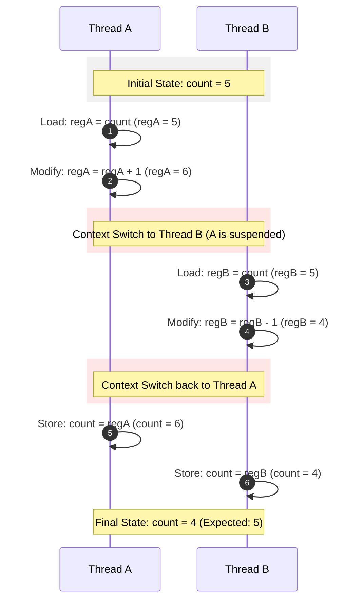

# 🏎️ Race Condition

> [!NOTE] Context & References
> **Parent Note**: [[Synchronization Tools]]
> **Theoretical Source**: [[BOOK - OPERATING SYSTEM CONCEPTS (Silberschatz, Galvin & Gagne)]]

---

## 📌 What is a Race Condition?

A **Race Condition** is an undesirable situation that occurs when multiple processes or threads concurrently access and manipulate shared data, and the final state of the data depends entirely on the **precise order (or timing)** in which their execution instructions are interleaved. 

When concurrent access is unrestricted, the system's scheduling algorithms can interrupt threads at unpredictable moments, leading to memory corruption, inconsistent state, or logic bugs that are notoriously difficult to reproduce and debug.

---

## 🔍 The Root Cause: High-Level vs. Assembly Instructions

Race conditions arise because seemingly atomic high-level programming statements (like `count++` or `count--`) actually translate into **multiple distinct assembly-level instructions** at the CPU level.

Consider a shared variable `count` initialized to **`5`**. Two threads run concurrently:
* **Thread A** executes `count++`
* **Thread B** executes `count--`

### 💻 Assembly Translation
At the machine level, these statements are executed as three separate operations:

| Thread A (`count++`) | Thread B (`count--`) |
| :--- | :--- |
| `1. regA = count` (Load) | `1. regB = count` (Load) |
| `2. regA = regA + 1` (Modify) | `2. regB = regB - 1` (Modify) |
| `3. count = regA` (Store) | `3. count = regB` (Store) |

---

### ⏱️ An Interleaved Execution Scenario (The Bug)

If Thread A and Thread B are interleaved arbitrarily by the OS scheduler, we can get the following trace:

In this interleaving, **the increment operation by Thread A is completely lost and overwritten**, leaving the system in an inconsistent state (`count = 4` instead of `5`).

---

## 🏛️ Real-World Examples

### 1. Updating Shared State (Counters/Balances)
As illustrated above, multi-threaded counters, bank account transactions (e.g., simultaneous deposit and withdrawal), or inventory systems can corrupt data when multiple threads read, modify, and write back state concurrently.

### 2. Operating System Kernel Data Structures
When two distinct processes request to open files simultaneously, the OS kernel must update its central list of active open files. If the kernel does not synchronize these writes, the linked list or table pointer could become corrupted, leading to file access errors or kernel panics.

### 3. Assigning Process Identifiers (PIDs)
When two processes concurrently spawn children using `fork()`, they request a new unique process ID from the OS:
1. Both read `next_available_pid` (e.g., `4012`).
2. Both assign `4012` to their child process.
3. Both increment `next_available_pid` to `4013`.

**The Failure:** Two independent running processes are now erroneously tagged with the same PID, breaking OS isolation.

---

## 🛡️ The Solution: Mutual Exclusion & Synchronization

To eradicate race conditions, systems must guarantee **Mutual Exclusion** over the **Critical Section** (the segment of code where shared resources are accessed).

The primary tools used to enforce this are:
* **Atomic Variables:** Hardware-supported instruction sequences that execute without interruption.
* **Mutex Locks (Mutual Exclusion):** Binary software locks where only one thread can acquire the lock at a time.
* **Semaphores:** Counters used to control access to a pool of resources.
* **Monitors:** High-level language constructs that encapsulate variables and guarantee only one thread is active inside the monitor at a time.
