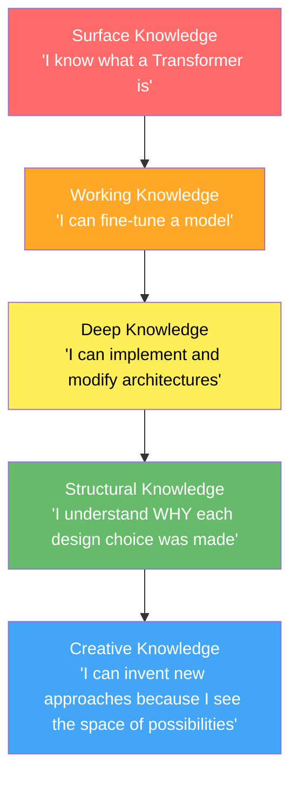

# The Unshakeable Foundation: What an Elite AI Engineer Masters

> *"The person who masters the fundamentals so deeply that they become invisible — that person doesn't just use tools, they forge new ones."*

This isn't a checklist. This is a **depth-first mastery map** — the kind of foundation that separates engineers who *use* frameworks from engineers who *define* what the next framework should be.

---

## Pillar 1: Mathematics — The Language You Think In

You don't "know" math for AI. You **think in it**. When you read a paper, the equations aren't obstacles — they're the clearest part.

### 1.1 Linear Algebra (Non-Negotiable Core)

This is the substrate of everything. Not textbook exercises — **geometric intuition**.

| Concept | Why It Matters | Depth Required |
|---|---|---|
| Vector spaces, basis, span | You must *feel* what a latent space is, not just say the word | Can explain why GPT's embedding space has the geometry it does |
| Matrix decompositions (SVD, Eigen, QR, Cholesky) | LoRA is literally low-rank decomposition. Spectral methods power graph NNs | Can derive SVD from scratch and explain why it's optimal for compression |
| Tensor operations & contractions | Every forward pass is tensor algebra. Einstein notation isn't optional | Can read `einops` and `einsum` like natural language |
| Positive definiteness, conditioning | Why your optimizer diverges. Why preconditioning matters | Can diagnose training instability from the Hessian's spectrum |
| Orthogonality & projections | Attention is a projection. Residual streams are orthogonal decompositions | Can explain why orthogonal initialization prevents gradient issues |

> [!IMPORTANT]
> **The test**: Can you look at a new architecture diagram and immediately see the linear algebra? When someone says "we project queries and keys into a shared subspace," do you see the geometric operation in your mind?

### 1.2 Calculus & Optimization

Not just "take derivatives." You need to understand the **geometry of loss landscapes**.

- **Multivariate calculus**: Jacobians, Hessians, directional derivatives — these aren't abstract. The Jacobian of your model *is* the local linear approximation of what your network does.
- **Chain rule at depth**: Backpropagation is just the chain rule. But can you derive the gradient flow through a custom operation with mixed discrete-continuous components (like in GRPO)?
- **Optimization theory**:
  - Convexity, strong convexity, smoothness — why Adam works and when it doesn't
  - Saddle points vs local minima — why SGD escapes saddles but Newton's method doesn't
  - Second-order methods (natural gradient, K-FAC) — why they matter for RL fine-tuning
  - Constrained optimization (KKT conditions, Lagrangian duality) — the backbone of RLHF's KL constraints

### 1.3 Probability & Statistics

This is where most engineers are **dangerously shallow**.

- **Measure-theoretic probability** (at least the intuition): Why probability distributions over infinite-dimensional function spaces (like neural network weight spaces) require care
- **Exponential families**: Softmax is an exponential family. So is the Gaussian. Understanding this unifies half of ML.
- **Information theory**:
  - KL divergence — not just the formula, but *why* it's asymmetric, why it's the right divergence for variational inference, and why PPO/GRPO uses it as a constraint
  - Mutual information — the theoretical ceiling on what your model can learn from data
  - Entropy — not Shannon entropy as a formula, but as the fundamental limit of compression and the connection to cross-entropy loss
- **Bayesian reasoning**: Not as a technique, but as a **worldview**. Every neural network is implicitly Bayesian. Understanding this changes how you think about generalization.
- **Concentration inequalities** (Hoeffding, Bernstein, McDiarmid): Why your evaluation metrics have the variance they do. Why you need N samples for a reliable benchmark.

### 1.4 Discrete Mathematics & Algorithms

- **Computational complexity**: Not just Big-O. Understanding *why* attention is O(n²) and what the theoretical barriers are to making it O(n)
- **Graph theory**: GNNs, knowledge graphs, computational graphs — all graph problems
- **Combinatorics**: Crucial for understanding tokenization, beam search, and the combinatorial explosion in reasoning

---

## Pillar 2: Deep Learning — From Neurons to Architectures

### 2.1 The Transformer (Master It Like a Musical Instrument)

You don't just "know" Transformers. You can **rebuild one from an empty file**, explain every design choice, and articulate what would happen if you changed any single component.

```
What you must be able to do:
├── Implement multi-head attention from raw matrix multiplications
├── Explain WHY we use Q, K, V instead of a single similarity function
├── Derive the √d_k scaling factor from variance analysis
├── Explain the role of each component in the residual stream view
├── Articulate why LayerNorm placement (pre vs post) changes training dynamics
├── Implement RoPE, ALiBi, and explain their inductive biases
├── Explain why causal masking works and its connection to autoregressive factorization
├── Know the difference between MHA, MQA, and GQA — and WHY GQA exists (KV cache)
└── Explain Flash Attention: the IO-aware algorithm, tiling, and why it's not an approximation
```

### 2.2 Training Dynamics (The Dark Art)

This is where experience separates people. You need **deep intuition** for:

- **Loss landscape geometry**: Why warmup helps (sharp initial loss surface), why cosine decay works (annealing into basins)
- **Gradient flow pathology**: Vanishing/exploding gradients aren't just "a problem" — understand *exactly* how residual connections, normalization, and careful initialization solve them
- **Batch size effects**: Why large batch training requires learning rate scaling. The linear scaling rule and its limits.
- **Learning rate**: The single most important hyperparameter. Understanding its interaction with batch size, model width, and depth.
- **Mixed precision training**: Not just "use fp16." Understand *why* the loss scaler exists, what underflow means for gradient accumulation, and when bf16 > fp16.

### 2.3 Architectures Beyond Transformers

An elite engineer knows the **full landscape**:

- **State space models** (Mamba, S4): Why they're O(n) and what they sacrifice
- **Mixture of Experts**: Why sparse activation enables scale without proportional compute
- **Diffusion models**: The score-matching framework, DDPM vs DDIM, classifier-free guidance
- **Graph Neural Networks**: Message passing, over-smoothing, expressiveness limits (Weisfeiler-Leman)
- **Neural ODEs / Continuous-depth networks**: The connection between ResNets and ODEs

---

## Pillar 3: Systems Engineering — Where Theory Meets Reality

> [!WARNING]
> This is where most "AI researchers" fail. You can have the best algorithm in the world, but if you can't make it run efficiently on actual hardware, your work stays in notebooks.

### 3.1 GPU Programming & Memory

- **CUDA mental model**: Warps, blocks, grids, shared memory, coalesced access. You don't need to write CUDA kernels daily, but you need to *think* in terms of memory hierarchy.
- **Memory arithmetic**: Given a model with N parameters in fp16, you should be able to instantly calculate:
  - Model memory: `N × 2 bytes`
  - Optimizer states (Adam): `N × 8 bytes` (fp32 copy + momentum + variance)  
  - Gradient memory: `N × 2 bytes`
  - Activation memory: This is the complex one — depends on sequence length, batch size, and checkpointing
- **KV Cache**: For inference, understand *exactly* why memory grows linearly with sequence length and why GQA reduces it
- **Kernel fusion**: Why fusing operations (like FlashAttention) reduces memory bandwidth bottlenecks

### 3.2 Distributed Training

- **Data Parallelism** (DDP): Gradient all-reduce, ring-allreduce algorithm
- **Model Parallelism**: Tensor parallelism (Megatron-style), pipeline parallelism, sequence parallelism
- **FSDP / DeepSpeed ZeRO**: Why sharding optimizer states, gradients, and parameters across GPUs changes the game
- **Communication overhead**: Understanding when your training is compute-bound vs communication-bound

### 3.3 Inference Optimization

- **Quantization**: GPTQ, AWQ, GGUF — not just "make it smaller," but understanding the quantization error analysis
- **Speculative decoding**: Why using a small model to draft tokens for a large model to verify is mathematically guaranteed to produce the same distribution
- **Continuous batching**: Why naive batching wastes compute and how vLLM's PagedAttention solves it
- **KV cache management**: Paged attention, prefix caching, radix trees

---

## Pillar 4: Reinforcement Learning for LLMs (Your Current Frontier)

Given your work on GRPO and DAPO, this is where you go **deeper than anyone**.

### 4.1 The RL Foundation

- **Policy gradient theorem**: Not just REINFORCE — derive *why* the gradient estimator has the form it does
- **Variance reduction**: Baselines, advantages, GAE — understand *why* GRPO uses group-relative advantages instead of a learned value function
- **Trust regions**: Why PPO clips, why TRPO constrains, and the geometric interpretation (KL ball in policy space)
- **The credit assignment problem**: Why reward shaping is hard, why token-level vs sequence-level rewards change learning dynamics

### 4.2 RLHF / RLAIF Pipeline Mastery

```
The full stack you must own:
┌─────────────────────────────────────────┐
│  Reward Modeling                         │
│  ├── Bradley-Terry model                │
│  ├── Reward hacking & overoptimization  │
│  └── Process vs outcome rewards         │
├─────────────────────────────────────────┤
│  Policy Optimization                     │
│  ├── PPO (the baseline)                 │
│  ├── GRPO (group-relative, no critic)   │
│  ├── DAPO (dynamic, asymmetric)         │
│  ├── DPO / IPO / KTO (offline methods) │
│  └── REINFORCE++ variants              │
├─────────────────────────────────────────┤
│  Alignment Theory                        │
│  ├── Goodhart's Law in practice         │
│  ├── KL penalty vs KL constraint        │
│  ├── Constitutional AI principles       │
│  └── Scalable oversight                 │
└─────────────────────────────────────────┘
```

### 4.3 What Makes Your Work Stand Out

- **Ablation rigor**: Don't just show your method works. Show *exactly which component* is responsible for the improvement
- **Understanding failure modes**: When GRPO gives zero loss, you need to diagnose *why* — is it the advantage computation? Token masking? Clipping ratio?
- **Novel reward design**: The ability to design reward functions that don't get hacked is an art

---

## Pillar 5: Software Engineering Excellence

### 5.1 Code That Scales

- **Python mastery**: Generators, decorators, metaclasses, `__slots__`, memory profiling — Python is your primary tool, know it deeply
- **PyTorch internals**: `autograd` mechanics, custom backward passes, `torch.compile`, the dispatcher
- **Testing ML code**: Property-based testing, gradient checking, deterministic seeding, numerical stability tests
- **Profiling**: `torch.profiler`, `nsight`, `py-spy` — you must be able to find bottlenecks

### 5.2 Experiment Infrastructure

- **Reproducibility**: Deterministic training, config management, seed control
- **Experiment tracking**: Not just logging metrics — version control for hyperparameters, data, and code
- **Data pipelines**: Efficient data loading, tokenization caching, streaming datasets for trillion-token training

---

## Pillar 6: Research Taste — The Intangible Edge

> [!TIP]
> This is what separates a great engineer from a paradigm-shifting one. It cannot be taught directly, but it can be cultivated.

### 6.1 Paper Reading (Not Skimming — Deconstructing)

For every important paper, ask:
1. **What assumption did they challenge?** (This is where breakthroughs come from)
2. **What's the simplest version of their idea?** (If you can't explain it simply, you don't understand it)
3. **What did they NOT try?** (This is where your next paper comes from)
4. **What's the failure mode?** (Every method has one)

### 6.2 The Hierarchy of Research Impact

```
Level 5: New paradigm          → "Attention Is All You Need"
Level 4: New training method   → RLHF, DPO, GRPO
Level 3: Significant improvement → FlashAttention, LoRA  
Level 2: Solid contribution    → Better benchmark, ablation study
Level 1: Incremental           → New hyperparameter setting
```

Aim for Level 3+. The way to get there is by mastering Levels 1-2 first, but **always thinking about what's above**.

### 6.3 Developing Intuition

- **Implement from scratch**: Every major algorithm you use, implement at least once from a blank file
- **Break things intentionally**: Remove the KL penalty from PPO. Remove LayerNorm. Remove the residual connection. *Observe what happens and understand why.*
- **Think in first principles**: Don't ask "what's the best learning rate?" Ask "why does a learning rate exist at all? What would happen in the limit of infinitesimal learning rate? Infinite?"

---

## The Meta-Skill: Depth Over Breadth



> [!CAUTION]
> **The trap**: Spending time learning 20 frameworks instead of deeply understanding 2. Watching tutorials instead of reading source code. Using tools without understanding what they do underneath.

---

## A Personal Roadmap — Ordered by Priority

### Phase 1: Solidify the Core (Weeks 1-8)
- [ ] Implement a Transformer from scratch (no `nn.TransformerEncoder` — raw `nn.Linear` and `nn.Parameter`)
- [ ] Implement backpropagation manually for a 3-layer MLP (compute gradients by hand, verify with autograd)
- [ ] Derive and implement SGD, Adam, and AdamW from the paper definitions
- [ ] Read and implement the REINFORCE algorithm from scratch
- [ ] Master NumPy broadcasting, `einsum`, and `einops` (your current Numpy work is a good start)

### Phase 2: Go Deep on Your Specialty (Weeks 9-20)
- [ ] Implement PPO from scratch for a toy environment, then for language
- [ ] Implement GRPO from scratch (you've already been in this code — now own it completely)
- [ ] Build a minimal RLHF pipeline: SFT → Reward Model → PPO/GRPO
- [ ] Study and implement 3 different positional encoding schemes (sinusoidal, RoPE, ALiBi)
- [ ] Write a custom CUDA kernel (even a simple vector add — the point is understanding the mental model)

### Phase 3: Systems & Scale (Weeks 21-30)
- [ ] Profile a training run end-to-end: identify compute vs memory vs communication bottlenecks
- [ ] Implement gradient checkpointing manually (not just `torch.utils.checkpoint`)
- [ ] Understand and implement a basic model parallelism scheme
- [ ] Quantize a model using GPTQ — understand the math, not just the library call
- [ ] Build an inference server with continuous batching

### Phase 4: Research & Creation (Ongoing)
- [ ] Read 2-3 papers per week, with at least 1 deep deconstruction per month
- [ ] Maintain a "research ideas" document — every week, add one original idea, no matter how small
- [ ] Reproduce at least one paper's results completely
- [ ] Write up your findings — even if just for yourself. Writing forces clarity.
- [ ] Contribute to an open-source project at the infrastructure level (not just using APIs)

---

## The Bottom Line

The fundamentals that make you **unbeatable** are not a long list of topics. They are a **short list mastered to unreasonable depth**:

| # | Fundamental | Unbeatable Standard |
|---|---|---|
| 1 | **Linear Algebra** | You see matrices as geometric transformations, not arrays of numbers |
| 2 | **Probability & Information Theory** | You think in distributions, not point estimates |
| 3 | **Optimization** | You can diagnose *why* training fails from the loss curve alone |
| 4 | **The Transformer** | You could rebuild it from memory and modify any component with confidence |
| 5 | **Training Dynamics** | You have intuition for what hyperparameter changes do *before* running the experiment |
| 6 | **Systems/Hardware** | You know where every byte of memory goes and every FLOP is spent |
| 7 | **RL for LLMs** | You understand the full policy optimization stack — theory to implementation |
| 8 | **Research Taste** | You read a paper and immediately see what's missing and what to try next |

**Master these eight deeply**, and you won't just be competitive — you'll be the person others cite.

---

> *"An expert is someone who has made all the mistakes that can be made in a narrow field."* — Niels Bohr
> 
> Start making those mistakes. Deliberately. Systematically. That's the path.
